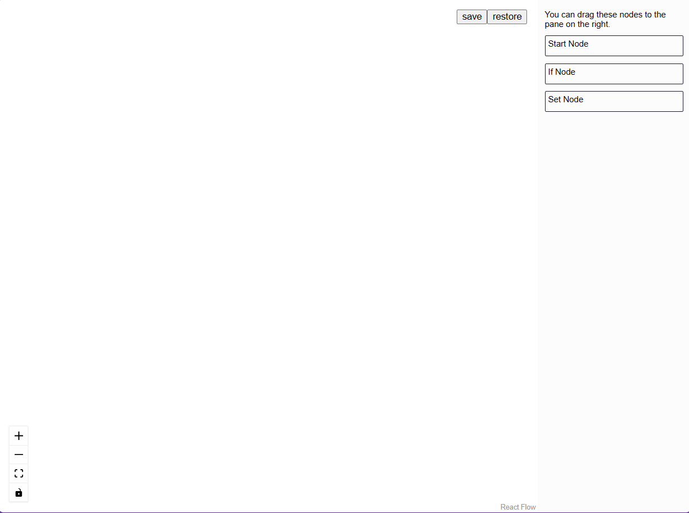
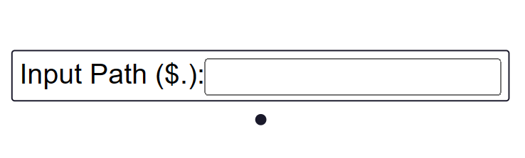
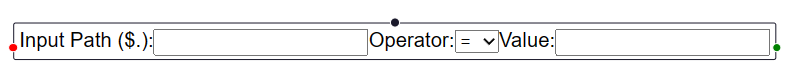
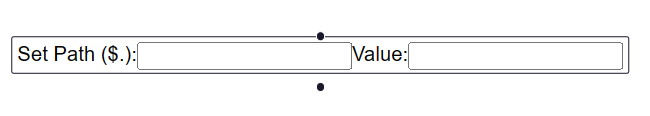

# Requirements

## Backend

- [Python 3.11](https://www.python.org/downloads/release/python-3115/)
- [Poetry](https://python-poetry.org/docs/#installation)

## Frontend

- [Node 18+](https://nodejs.org/en)
- [Pnpm](https://pnpm.io/installation)

## Database

- [MongoDB](https://hub.docker.com/_/mongo/)

# Getting start (development)

## Backend

- Goto backend folder in terminal
- Configure [.env](./backend/.env) file variables
- Install dependencies: `poetry install`
- Run application: `poetry run uvicorn app.main:app --reload`

## Frontend

- Goto frontend folder in terminal
- Configure [.env](./frontend/.env) file variables
- Install dependencies: `pnpm install`
- Run application: `pnpm dev`
- Open application: http://localhost:5173

# Building a flow

When you open the application, the following screen will appear:

## Controls and buttons

The following elements can be seen on the screen:

- Board controls: These have 4 buttons which, from top to bottom, are:

  - Zoom +
  - Zoom -
  - Screen Fit
  - Screen lock

- Storage control: Located above the right diagonal, it is responsible for saving the flow and restoring it to the last saved state.

- Sidebar: contains all the nodes that can be used, starting with the "Start Node". There are also the "if node" and "set node" nodes.

## Nodes

### Start Node

Defines the slice of the payload sent that should be considered in the flow.  
Parameters:

- input path: path to the part of the payload to be considered.

Example:

> Payload: {"a":{"b":{"c":1}}
>
> input path: "a.b"
>
> New payload: {"c": 1}

### If Node

Performs flow diversion by data comparison. If it's false it goes to the left, if it's true it goes to the right.

Parameters:

- input path: path to the part of the payload to be compared.
- operator: comparison to be performed.
- value: comparison value.

Example:

> Payload: {"a":{"b":{"c":1}}
>
> input path: "a.b.c"
> operator: =
> value: 1
>
> Redirect to right.

### Set Node

Performs insertions or overwrites in the payload.

Parameters:

- set path: path to be inserted value. It doesn't need to exist beforehand and when empty it overwrites the entire payload.
- value: value to be inserted.

Example:

> Payload: {"a":{"b":{"c":1}}
>
> input path: "a"
> value: "abc"
>
> New payload: {"a": "abc"}

# Running a flow

To run a flow, simply make a post to {backend_host}/flow/execute/{flow_id}, in which the flow id is currently set to "example-flow".

The body must contain the payload to be executed in the flow and its format is json.

The payload resulting from the execution of the flow will be returned if everything is correct.
